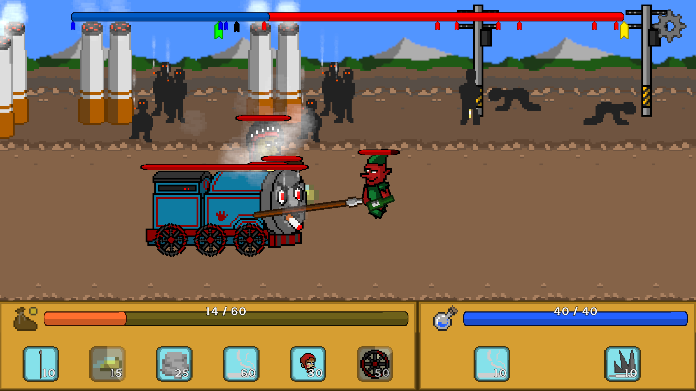
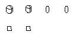

# 개인 프로젝트 - 중독자들의 전쟁

  
  

**플레이 영상:** https://youtu.be/uH6z3EnvdvY

---

## 게임 소개

"직접 싸우거나, 소환해서 밀어붙이거나."

플레이어가 직접 조작하는 캐릭터와 소환만 가능한 미니언으로 적 진영을 밀어내는 횡스크롤 디펜스 게임입니다.
스테이지마다 사용 가능한 미니언이 제한되고, 전투 보상으로 미니언 해금·강화와 덱 편성을 진행합니다.

---

## 🎮 프로젝트 개요

| 항목 | 내용 |
| ------ | ------ |
| **프로젝트명** | 중독자들의 전쟁 |
| **개발 기간** | 2025.07.07. ~ 2025.07.17. (11일) |
| **개발 인원** | 1인 (기획·프로그래밍·그래픽 어셋) |
| **개발 엔진** | Unity 2022.3 LTS |
| **개발 언어** | C# |
| **타겟 플랫폼** | Windows |

> 유닛·배경 등 그래픽 어셋은 전부 직접 제작했으며, 저장소에는 포함하지 않았습니다.

---

## 주요 기능

### 유닛 구조
* 스테이터스(`UnitData` ScriptableObject)와 행동(`Pawn`, 상태 패턴)을 분리
* 미니언은 Idle / Move / Attack / Skill / BackStep / Stay / Die 상태로 동작
* 특수 미니언(넉백, 정신 지배, 마녀)은 `SpecialPawn`을 상속해 고유 동작만 추가

> #### 관련 스크립트 및 폴더 링크
> * [**Unit**](https://github.com/Sirosi/TheWarOfAddicts/tree/main/Assets/_Project/Scripts/Unit)
> * [Unit.cs](https://github.com/Sirosi/TheWarOfAddicts/blob/main/Assets/_Project/Scripts/Unit/Unit.cs)
> * [Pawn.cs](https://github.com/Sirosi/TheWarOfAddicts/blob/main/Assets/_Project/Scripts/Unit/Pawns/Pawn.cs)
> * [**Unit/Pawns/State**](https://github.com/Sirosi/TheWarOfAddicts/tree/main/Assets/_Project/Scripts/Unit/Pawns/State)
> * [**Unit/Pawns/SpecialPawn**](https://github.com/Sirosi/TheWarOfAddicts/tree/main/Assets/_Project/Scripts/Unit/Pawns/SpecialPawn)

 

### 플레이어 및 무기
* 플레이어는 직접 조작 캐릭터로, 무기별 데이터(`WeaponData`)에 따라 공격 방식이 달라짐
* 투사체는 직선/포물선 두 종류를 `ProjectileBase`로 통일

> #### 관련 스크립트 및 폴더 링크
> * [PlayerBase.cs](https://github.com/Sirosi/TheWarOfAddicts/blob/main/Assets/_Project/Scripts/Unit/Player/PlayerBase.cs)
> * [**Unit/Player/Weapon**](https://github.com/Sirosi/TheWarOfAddicts/tree/main/Assets/_Project/Scripts/Unit/Player/Weapon)
> * [**Projectile**](https://github.com/Sirosi/TheWarOfAddicts/tree/main/Assets/_Project/Scripts/Projectile)

 

### 스테이지 및 진행 데이터
* 스테이지 정보(배경, 스폰 패턴, 보상, 사용 가능 미니언)는 ScriptableObject로 관리
* 업그레이드 수치·해금 상태·덱 편성은 `PlayerData`에 모아 JSON으로 저장/로드

> #### 관련 스크립트 및 폴더 링크
> * [**GameFlow/StageData**](https://github.com/Sirosi/TheWarOfAddicts/tree/main/Assets/_Project/Scripts/GameFlow/StageData)
> * [PlayerData.cs](https://github.com/Sirosi/TheWarOfAddicts/blob/main/Assets/_Project/Scripts/GameFlow/PlayerData.cs)
> * [SODataManager.cs](https://github.com/Sirosi/TheWarOfAddicts/blob/main/Assets/_Project/Scripts/GameFlow/SODataManager.cs)
> * [InGameManager.cs](https://github.com/Sirosi/TheWarOfAddicts/blob/main/Assets/_Project/Scripts/GameFlow/InGame/InGameManager.cs)

 

### 덱 편성 및 강화 UI
* 스테이지별 사용 가능 미니언 제한에 맞춰 덱 슬롯을 편성
* 미니언·무기 업그레이드는 `UpgradeData` 기반으로 버튼과 수치를 자동 구성

> #### 관련 스크립트 및 폴더 링크
> * [**UI/StageSelect**](https://github.com/Sirosi/TheWarOfAddicts/tree/main/Assets/_Project/Scripts/UI/StageSelect)
> * [DeckBuildManager.cs](https://github.com/Sirosi/TheWarOfAddicts/blob/main/Assets/_Project/Scripts/UI/StageSelect/DeckBuildManager.cs)
> * [**UI/InGame**](https://github.com/Sirosi/TheWarOfAddicts/tree/main/Assets/_Project/Scripts/UI/InGame)

---

 

## 특이사항

* 그래픽 어셋을 직접 제작해야 했기 때문에, 유닛 전부를 동일한 2D Skeleton 템플릿으로 만들고 단일 Animation Controller를 공유해 애니메이션 작업 비용을 줄였습니다.

---